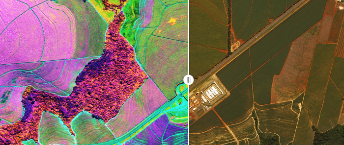

# hyperspectral-images

Processing of [HSIs](https://en.wikipedia.org/wiki/Hyperspectral_imaging): spectral unmixing and classification.

This is a project for the course **Machine Learning and Computational Statistics**, carried out during the Winter 
Quarter 2020-21 of the MSc in Data Science, AUEB.



### Installation

Apart from cloning the repository locally, a Python `3.8.x` interpreter is also required.

```shell
python3 -m pip install poetry
```
This will install the project's dependency manager, [poetry](https://python-poetry.org/).

To install the project dependencies, type:

```shell
poetry run python -m pip install --upgrade pip
```

and then:

```shell
poetry install
```

### Reproduction

To run any available Jupyter notebook, you can do so through:

```shell
poetry run jupyter notebook
```
